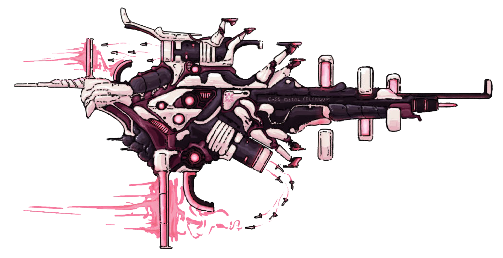

# Spear Of Odin
SSC Apeiron-Class Strike Carrier  

|Cost|HP|Wings|Defense|
|:-:|:-:|:-:|:-:|
|6|14|4|15|

[Trails](#traits)  
[Wings](#wings)   

## Traits
> ### SINGULARITY CATAPULTS
> _Trait_  
> `WINGS` equipped by this ship increase both the maximum and minimum ranges of all of their effects and abilities by `1`. For example, a WING that would usually have range `2–0` is instead range `3–1`.

## Wings
> ### BALOR CHASSIS WING
> _3 points_  
> _Wing, [Boarding](../terms.md#boarding), [Greywash](../terms.md#greywash), [Unique](../terms.md#unique)_  
> _8 HP, Tenacity 12_  
The Balor’s nanoswarm construction allows it to hellishly regenerate physical damage sustained during combat. During the Logistics Phase, this unit repairs 2 HP.  
>Additionally, gain the following tactic:  
>> ### BALOR COMMAND
>> _Tactic_  
>> _Range 4—1_  
>> Give the `BALOR CHASSIS WING` one of the following commands:  
>>> NANOCOMPOSITE MUNITIONS:  
>>> Deal `2 damage` to a hostile `ESCORT` or `WING`, or consume `LOCK ON` from a `CAPITAL SHIP` to deal `2 damage` to that ship, give it `2 GREYWASH COUNTERS`, and take `2 damage` in return.
>>
>> or
>>
>>> HIVE FRENZY:  
>>> Assign this unit to board a hostile `CAPITAL SHIP`. Each time it succeeds on a boarding roll, the boarded ship gains `2 GREYWASH COUNTERS`. Ships do not remove `GREYWASH COUNTERS` during the `Impact Phase` while this `WING` is aboard them.

> ### LEGION DRONE NEXUS x3
> _0 points_  
> _Wing_  
> _4 HP_  
> `1/round`, you may order a `LEGION DRONE NEXUS` in your battlegroup to interpose itself between friendly units and incoming fire. Reduce hostile damage dealt to an `ESCORT` or `WING` in your battlegroup or an allied battlegroup in the same range band by `1`. This `WING` then takes `2 damage`.  
> Additionally, gain the following tactic:
>> LEGION COMMAND  
>> _Tactic_  
>> _Range 4–1_  
>> Choose one `LEGION DRONE NEXUS` assigned to your battlegroup and give it the following command. As part of this, you may assign another unused `LEGION DRONE NEXUS` from your battlegroup to join the sortie, giving them the same command. Allied battlegroups in your range band may use this tactic to command your `LEGION DRONE NEXUSES` as if they were under their control:
>>> HUNT/KILL:  
>>> Deal `1 damage` to a hostile `CAPITAL SHIP`, `ESCORT`, or `WING`, or deal `2 damage` to a hostile `ESCORT` or `WING` and take `2 damage` in return.

---
[Longstar](../longstar.md)